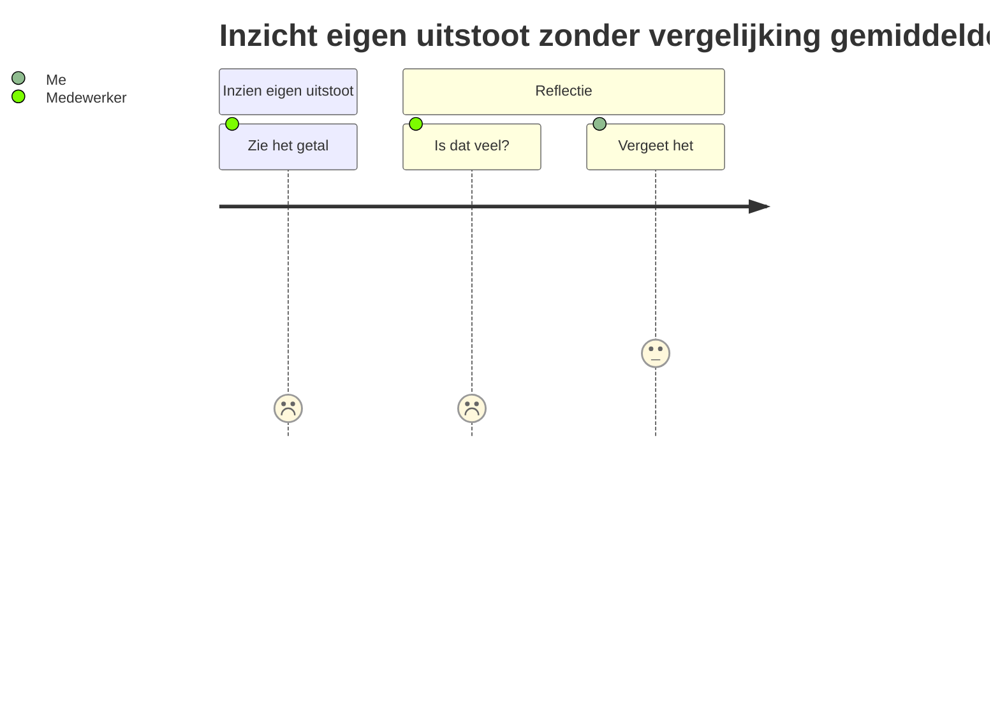
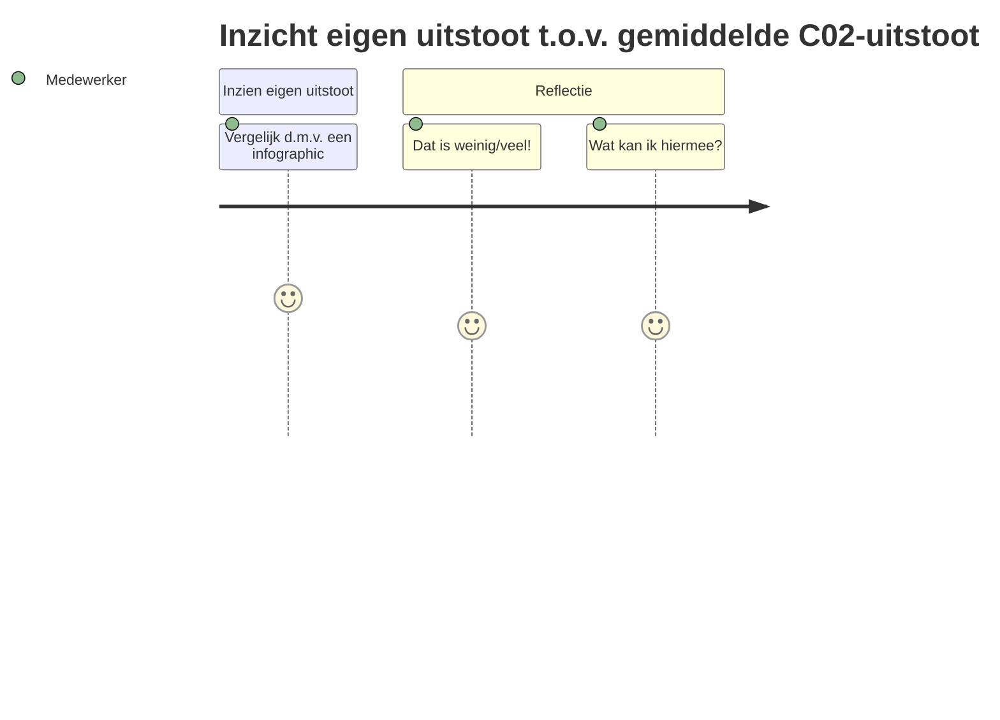

# 3. Aanpak

In de aanpak zal ik omschrijven hoe het er uiteindelijk hoort uit te gaan zien. Grotendeels door wireframes maar ook
door aangemaakte links naar Milestones in het github project.

Klik hier voor wireframes op Figma

## 3.1 Knelpunten

Punten van bijzondere aandacht.

3.1.1. [De data moet fiscaal juridisch correct worden ingevoerd. (Normerende regeling werkgebonden personenmobiliteit)](https://github.com/HU-SD-SV2FE-studenten-2022/v2fe-v2a-2/milestone/7)

3.1.2. [De ingevoerde data moet analyseerbaar zijn voor bevoegden, en exporteerbaar.](https://github.com/HU-SD-SV2FE-studenten-2022/v2fe-v2a-2/milestones?with_issues=no)

3.1.3. [Er moet een controle zijn op misbruik zakelijke reisdeclaraties](https://github.com/HU-SD-SV2FE-studenten-2022/v2fe-v2a-2/milestone/9)

3.1.4. [Multi-platform applicatie, om het zo toegankelijk mogelijk te maken.](https://github.com/HU-SD-SV2FE-studenten-2022/v2fe-v2a-2/milestone/10)

3.1.5. [Er moet goed gekeken worden naar accessibility.](https://github.com/HU-SD-SV2FE-studenten-2022/v2fe-v2a-2/milestone/11)

## 3.2 Kansen

##### 3.2.1 Kans bieden om medewerkers **flexibel** te laten reizen; veel, weinig of afwisselend.

>
3.2.1.1 [Medewerkers kunnen zelf bepalen of ze op vaak reizen naar locatie of niet.](https://github.com/HU-SD-SV2FE-studenten-2022/v2fe-v2a-2/milestone/4)

>
3.2.1.2 [Door ook prive reizen te documenteren hebben we een volledig overzicht, en kunnen we medewerkers betrokken houden dmv beloningen](https://github.com/HU-SD-SV2FE-studenten-2022/v2fe-v2a-2/milestone/5)

>
3.2.1.3 [Eventueel automatisch herhalende reizen voor groepen die dagelijks dezelfde reis afleggen.](https://github.com/HU-SD-SV2FE-studenten-2022/v2fe-v2a-2/milestone/6)

##### 3.2.2 Kans bieden om **persoonlijke voorkeur** te hebben qua vervoerstype.

3.2.2.1 [Inzicht tonen in C02 uitstoot van elk type vervoersmiddel bij de invoer](https://github.com/HU-SD-SV2FE-studenten-2022/v2fe-v2a-2/milestone/1)

3.2.2.2 [Medewerkers een keuzemenu aanbieden van verschillende vervoersmiddelen](https://github.com/HU-SD-SV2FE-studenten-2022/v2fe-v2a-2/milestone/3)

##### 3.2.3. Incentief geven om **duurzaam** te reizen; verleiden tot.

>
3.2.3.1 [Visualiseren hoe eigen reizen vergelijken met het gemiddelde qua duurzaamheid.](https://github.com/HU-SD-SV2FE-studenten-2022/v2fe-v2a-2/milestone/2)

-*----------------------*-------------------------------------------*----------------------*
------------------------------------------

## De Opdracht

De opdracht komt voort uit klimaatplannen.
Deze zijn qua reisgedrag onder te brengen in de volgende categorieën:

* Non-ambulant *Vaste reiskostenvergoeding*
* Non-ambulant *Vergoeding op declaratiebasis*
* Ambulant *Lease auto*
* Ambulant *Mobiliteitsbudget vast*
* Ambulant *Mobiliteitsbudget vast/variabel*

***

## De KPN heeft hiervoor zelf een vervoersbeleid geschreven:

_Dit is het beleid dat de medewerkers moeten voelen:_

- Persoonlijk: reizen zoals jij wilt
- Flexibel: veel, weinig of afwisselend
- Duurzaam: verleiden tot duurzaam reizen

***

## Probleemstelling en hoofddeelvragen

_De hoofd vraag:_

### Hoe kunnen we nou van alle medewerkers makkelijk en correct alle reisdata verzamelen?

* [Hoe bieden wij een beveiligde omgeving/app](https://github.com/HU-SD-SV2FE-studenten-2022/oefenrepo-Ryan-Reddy/issues/7)
* [Hoe krijgt de medewerker een formulier toegespitst op zijn reisgroep ?](https://github.com/HU-SD-SV2FE-studenten-2022/oefenrepo-Ryan-Reddy/issues/3)
* [Hoe kunnen we de data goed tonen?](https://github.com/HU-SD-SV2FE-studenten-2022/oefenrepo-Ryan-Reddy/issues/13)
* Hoe kunnen we de data het best opslaan? TODO
* Hoe verwerken we de data? TODO

***

## Een Kilometer registratie systeem.

_Wat wil de KPN nou van ons?_

* Faciliteren keuze mogelijkheiden medewerkers (eigen vervoer, openbaar vervoer, leaseauto, leasefiets,
  mobiliteitsbudget)
* Correcte fiscale onderbouwing
* Integrale registratie van werkgerelateerde km's tbv periodieke toetsing km norm
* Inzichten in alle reisbewegingen en reiskosten -> grip op het beheersen en verlagen hiervan
* Mobiele app (mulit-platform) en via browser (zelfde look & feel)
* Inclusief zijn tbv medewerkers met beperkingen (zien, horen)

***